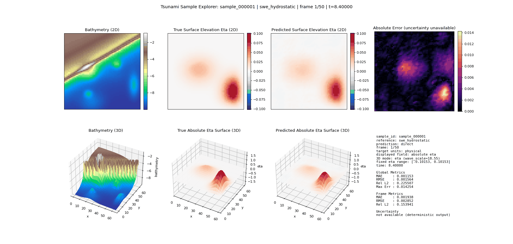

# Tsunami Surrogate Modeling with Neural Operators

## 1) Project Idea

This repository builds a research benchmark for fast surrogate modeling of tsunami-like wave propagation in a controlled synthetic setting.

Instead of running a numerical PDE solver online for every scenario, we train neural surrogates to learn:

`(bathymetry, source/initial disturbance) -> future wave-height trajectory`

The scope is research and benchmarking, not an operational early-warning deployment system.

### Representative rollout



This archived 50-frame Hydrostatic example shows bathymetry, the numerical-reference surface elevation, the surrogate prediction, and absolute error on a shared physical scale. It illustrates the model and visualization interface; it is not evidence from the accepted fresh-generation contract and must be regenerated after fresh training. Use the evaluation commands below for reported metrics.

## 2) Research Questions

The current forward-surrogate benchmark focuses on:

1. Fidelity: how closely predictions match the shallow-water solver.
2. Speed: how much inference acceleration is gained over full numerical rollout.
3. Robustness: how performance changes under distribution shift (unseen bathymetry/source families) and cross-resolution transfer.
4. Uncertainty quality: whether predictive confidence tracks actual error.

Separate follow-up track (not part of the current forward-surrogate paper):

5. Inverse problem: recover source characteristics from observed wave signals/fields.

## 3) What Is Implemented vs Planned

- Implemented core: synthetic data generation, preprocessing, forward surrogate training, and benchmark evaluation.
- Implemented models: FNO (primary), F-FNO, CNN, U-Net, ConvLSTM, U-FNO,
  WNO, mode ablations, native-resolution variants, and ensemble paths for
  comparison. The released evaluation includes the completed ConvLSTM
  baseline; no further ConvLSTM training is required for the current study.
- Implemented evaluations: accuracy, speed, generalization, resolution transfer, and uncertainty.
- Separate follow-up work: dedicated inverse-problem experiments and a separate paper track.

### 3a) Current benchmark status

Updated: 2026-09-01.

The canonical train, validation, and test configs now define the accepted fresh-generation contract: seeds 42/271/911; 10,000/1,000/2,500 scenarios; 50 requested times from 8.4 through 420.0; shared 384-grid master inputs; 128-grid solver inputs; buffered 192-grid computation; and central 64-grid publications for Hydrostatic, MUSCL-HR, and Boussinesq. The semantic contract hash is `288d19af5e8f5fe1658c098bf972ada97292a08fe35ed99c086406a291576d2f`.

Earlier datasets, checkpoints, and evaluation results belong to the archived campaign and must not be mixed into this fresh rebuild. The current source has passed the full test suite and isolated all-reference generation/resume canaries, but fresh full generation, preprocessing, training, and evaluation are still required before manuscript values are updated. The native-resolution and real-bathymetry auxiliary generation configs remain deferred until they are independently ported to and verified against the accepted scaling contract.

The final evaluation interface is deliberately small:

```bash
# Read-only preflight; creates no evaluation outputs.
bash scripts/run_eval_suite.sh

# Read-only preflight including all seven ensemble members.
bash scripts/run_eval_suite.sh --include-ensemble

# Read-only preflight for every metric declared in the core paper suite.
# This implies the seven-member ensemble.
bash scripts/run_eval_suite.sh --include-paper-evidence

# Full final execution for a new reproducible evaluation run.
bash scripts/run_eval_suite.sh \
  --execute \
  --run-id <immutable-run-id> \
  --device cuda \
  --include-paper-evidence \
  --include-speed \
  --deep-payload-audit \
  --rerun-numerical-validation
```

The real-bathymetry suite is included by default. Paper evidence implies the
ensemble;
speed and the fresh numerical-validation chain remain explicit because they are
the longest lanes. Numerical validation requires a clean committed
`src/`/`scripts/`/`configs/` source state and creates a checksum-bound archive
inside the isolated evaluation run. The command writes a new run directory;
remove older results only after the new run has been checked.

All later work should meet the project standard of polished research software: scientifically defensible scope, explicit provenance, fail-closed data and checkpoint boundaries, reproducible commands, proportionate tests, and no paper/production claim stronger than the artifacts support.

## 4) Main Workflow

The default full-module pipeline in this repo is:

1. Generate synthetic physics rollouts.
2. Preprocess into train/val/test tensors.
3. Train surrogate models.
4. Evaluate solver-fidelity, speed, robustness, and uncertainty.
5. Export plots/tables and map outputs into paper sections.
6. Keep inverse-problem workflow as a separate follow-up track (outside current forward-paper claims).

For the released results, restore the benchmark package before evaluation. For
a new rebuild, start with the raw-data generation path in Section 5b.5 and
continue through the detailed from-scratch command archive in Appendix A.

## 5) Setup

```bash
git clone https://github.com/1zuki/tsunami-surrogate.git
cd tsunami-surrogate
python3 --version  # must report Python 3.10.x
python3 -m venv .venv
source .venv/bin/activate
python -m pip install -r requirements.txt
```

For a fresh Linux or Google Cloud VM, install Git, Python 3.10, and the
`zstd` command-line tools (`tar` must be able to run `unzstd`). A source-only
check needs only the repository and Python environment. The released reproduction
archives total about 40.6 GB before extraction and their recorded source
payloads are about 41.0 GB; keep at least 100 GB free if the VM retains both
the downloaded archives and extracted data/checkpoints. The raw publication
mirror is much larger and is not needed for the normal check.

## 5a) Reproducibility notes

The intended runtime is Python 3.10, with dependencies listed in
`requirements.txt`. Paper CUDA timing rows use the recorded speed metadata from
runs with PyTorch 2.10.0+cu128 and CUDA 12.8. The release includes all 33
selected checkpoints together with their resolved configurations and training
histories. This archive supports research benchmark reproducibility, not
operational tsunami prediction.

## 5b) Fresh-machine checks, generation, and result verification (recommended)

Cloning the GitHub repository does **not** download the ignored datasets,
checkpoints, or evaluation archives. Do not start by running every historical
command in Appendix A. You can either restore the released benchmark package
or rebuild the solver data from scratch:

- **Archived-result inspection:** restore the processed data, checkpoints, and archived evidence described in Section 5b.2 only when inspecting the earlier campaign; do not mix those artifacts with a fresh rebuild.
- **From-scratch path:** generate the raw solver publications with the
  split-specific configs in Section 5b.5, then continue with the detailed
  generation, preprocessing, training, and evaluation commands in Appendix A.

The sections below cover source checks, released data, evaluation, and
from-scratch generation:

### 5b.1 Source check

This checks the installed dependencies, imports, Python compilation, and shell
syntax. It does not regenerate solver data, retrain models, or establish
scientific validity.

```bash
PYTHONPATH=. python -c "import numpy, torch, scipy, yaml; import src"
python -m compileall -q src scripts
bash -n scripts/*.sh
```

The broader non-slow pytest collection is optional. It can take substantially
longer than this check and some tests exercise release-only scientific
fixtures (for example, strict-holdout manifests):

For a fast contract-level check that works from a bare clone:

```bash
python -m pytest -q \
  tests/test_alignment.py \
  tests/test_model_io.py \
  tests/test_device_precision.py
```

```bash
# pytest is an optional test dependency and may need a separate install.
python -m pip install pytest
OPENBLAS_NUM_THREADS=1 \
OMP_NUM_THREADS=1 \
MKL_NUM_THREADS=1 \
NUMEXPR_NUM_THREADS=1 \
VECLIB_MAXIMUM_THREADS=1 \
BLIS_NUM_THREADS=1 \
PYTHONPATH=. \
python -m pytest -q -m 'not slow'
```

Run it after restoring the release artifacts when you want the broader
implementation check. Passing it is still not a replacement for the
data/evaluation and numerical-validation checks below.

### 5b.2 Released-data check

Download the released reproduction package from the Zenodo record and verify
its contents before extracting it:

```bash
REPO="$PWD"
BUNDLE="$HOME/tsunami-surrogate-reproduction"

(cd "$BUNDLE" && sha256sum -c SHA256SUMS.txt)

# Required for the main direct-model and paper-evidence datasets.
for f in "$BUNDLE"/main_processed/*.tar.zst; do
  tar --use-compress-program=unzstd -xf "$f" -C "$REPO"
done
tar --use-compress-program=unzstd \
  -xf "$BUNDLE/models/selected_checkpoints.tar.zst" \
  -C "$REPO"

# Required by the auxiliary/paper matrix.
tar --use-compress-program=unzstd \
  -xf "$BUNDLE/models/multiseed_checkpoints.tar.zst" \
  -C "$REPO"
for f in "$BUNDLE"/supplementary/*.tar.zst; do
  tar --use-compress-program=unzstd -xf "$f" -C "$REPO"
done
```

Keep the archived result bundles outside the repository source directory so they cannot
silently overwrite current helper scripts:

```bash
EVIDENCE="$HOME/tsunami-surrogate-evidence"
mkdir -p "$EVIDENCE"
tar --use-compress-program=unzstd \
  -xf "$BUNDLE/results/final_paper_evaluation.tar.zst" \
  -C "$EVIDENCE"
tar --use-compress-program=unzstd \
  -xf "$BUNDLE/results/multiseed_geoclaw_evidence.tar.zst" \
  -C "$EVIDENCE"
```

The extracted evidence contains the validated archived paper run and the later
multiseed/GeoClaw analysis outputs. The release archive records the historical
evaluation code state as commit
`043fff969ebd887b2b4b5dbf1e3f5db00584d97b`; current `main`
contains later analysis/documentation changes. Do not mix a historical
evidence directory with a newly generated run.

For a small independent model/data check after extraction, run one metric
directly and write its output outside the repository:

```bash
mkdir -p "$HOME/tsunami-source-check"
python scripts/eval_accuracy.py \
  --config configs/model/fno.yaml \
  --checkpoint experiments/fno/best.pt \
  --device cpu \
  --output "$HOME/tsunami-source-check/fno_hydrostatic.json"
```

The full fail-closed `run_eval_suite.sh` additionally expects the complete
project provenance used by the final run: frozen generation artifacts,
training sidecars such as `checkpoints/last.pt`, and a clean evaluation source
state. The release upload intentionally packages selected `best.pt` files,
resolved configs, histories, processed data, and archived evidence rather than
turning the Zenodo download into a full editable project copy. Therefore,
on a bare fresh clone, use the source check and direct metric check above
to verify the public source; run the full wrapper only from a fully restored
project directory that contains those additional supporting run records.

### 5b.3 Full evaluation

On a fully restored project directory, first run the read-only preflight:

```bash
# CPU is portable; use --device cuda on a configured CUDA VM.
bash scripts/run_eval_suite.sh --include-paper-evidence --device cpu
```

If it passes, execute the suite once with a new immutable run ID. Results are
staged under `evaluation_runs/<run-id>.staging/` and promoted only after
consolidation validates the declared outputs:

```bash
bash scripts/run_eval_suite.sh \
  --execute \
  --run-id source-check-20260824-r1 \
  --device cpu \
  --include-paper-evidence
```

Use `--device cuda` on a configured GPU VM. Add `--include-speed` only when
timing rows are intentionally being regenerated, and add
`--deep-payload-audit` when a full payload re-hash is wanted. Do not reuse an
existing run ID, and do not run the complete suite twice unless the first run
fails or the environment changes. The paper-evidence option already includes
the seven-member ensemble and every metric declared in the paper suite.

The separate three-seed direct-model and GeoClaw-discrepancy follow-up
analyses are packaged and rerun separately; they are not silently folded into
this wrapper. From a fully restored project directory, their commands are:

```bash
bash scripts/run_multiseed_evaluation.sh --preflight-only
bash scripts/run_multiseed_evaluation.sh
python scripts/run_geoclaw_discrepancy_ablation.py --workers 4
```

These commands write separate multiseed/GeoClaw outputs. If the archived
outputs are sufficient for the review, inspect those instead of regenerating
them.

### 5b.4 Optional fresh numerical-validation replay

The numerical-validation flag is a separate, much heavier H0/Level-A/Level-B/
H1/H2 replay. It requires a clean committed `src/`/`scripts/`/`configs/` state,
GeoClaw 5.14.0, PETSc, and the paths supplied through the environment:

```bash
export CLAW_ROOT=/path/to/clawpack-v5.14.0
export PETSC_DIR=/path/to/petsc-3.25.3
export PETSC_ARCH=arch-linux-c-opt
export GEOCLAW_PYTHON="$PWD/.venv/bin/python"

bash scripts/run_eval_suite.sh \
  --execute \
  --run-id source-check-20260824-numerical-r1 \
  --device cpu \
  --include-paper-evidence \
  --deep-payload-audit \
  --rerun-numerical-validation
```

If GeoClaw/PETSc are not installed, omit this flag and inspect the archived
numerical evidence instead. Do not regenerate the approximately 31 GB raw
publication set or retrain the ensemble merely to check out the source.

### 5b.5 Generate the raw benchmark from scratch

The repository supports rebuilding the synthetic solver data instead of downloading processed archives. The full core campaign creates 10,000 training, 1,000 validation, and 2,500 test scenarios for each of the three configured references (40,500 solver publications in total). This is a large CPU/storage workload; reserve at least 100 GB for the raw campaign and additional space for processed arrays, checkpoints, and evaluation outputs.

For this core launch, use only `configs/data/dataset.yaml`, `configs/data/dataset_eval.yaml`, and `configs/data/dataset_test.yaml`. Do not launch `configs/data/multires/dataset_*.yaml` or `configs/data/real_bathymetry_v2/*_dataset.yaml`; those auxiliary configs are deliberately marked provisional until their spatial and temporal scaling is redesigned and validated.

From the repository root, after completing Section 5, run the split-specific
generation configs:

```bash
set -o pipefail
export OMP_NUM_THREADS=1 OPENBLAS_NUM_THREADS=1 MKL_NUM_THREADS=1
export NUMEXPR_NUM_THREADS=1 BLIS_NUM_THREADS=1 VECLIB_MAXIMUM_THREADS=1

# Train split: 10,000 scenarios.
python scripts/make_dataset.py --config configs/data/dataset.yaml 2>&1 | tee train-generation.log

# Validation/evaluation split: 1,000 scenarios.
python scripts/make_dataset.py --config configs/data/dataset_eval.yaml 2>&1 | tee validation-generation.log
```

These commands write raw publications and provenance manifests under `data/train/` and `data/eval/`. Add `--continue` to the same command after an interruption and use `tee -a` to append to the existing log; completed publications are validated and reused. Keep the seed-911 final test split unopened until the model matrix and analysis choices are frozen, then generate it with `python scripts/make_dataset.py --config configs/data/dataset_test.yaml 2>&1 | tee test-generation.log`.

Do not use a reduced `--num-samples` value against a canonical split root if that root will later be expanded to the full split: the paired-input inventory intentionally freezes the configured roster. Small canaries must use isolated output, bathymetry, source, manifest, and paired-inventory paths; the full production command should then start from the empty canonical root.

An isolated eight-worker canary can be run without touching the canonical roots:

```bash
CANARY_ROOT="$(mktemp -d /tmp/tsunami-surrogate-canary.XXXXXX)"
python scripts/make_dataset.py \
  --config configs/data/dataset.yaml \
  --num-samples 8 \
  --num-workers 8 \
  --stop-at 8 \
  --bathymetry-dir "$CANARY_ROOT/bathymetry" \
  --source-dir "$CANARY_ROOT/sources" \
  --output-dir "$CANARY_ROOT/raw" \
  --manifest-path "$CANARY_ROOT/synthetic/scenario_manifest.jsonl" \
  --paired-inventory-path "$CANARY_ROOT/synthetic/native_input_inventory.jsonl" \
  2>&1 | tee "$CANARY_ROOT/generation.log"
```

This canary root is disposable and must not be copied into `data/train/`. A successful run produces eight scenario rows, eight rows in each solver manifest, 24 quality-`ok` publications, and one complete operational shard bound to the accepted contract hash.

After all three raw splits exist, preprocess them in this order:

```bash
# 1. Required first: fits normalization statistics from training data only.
python src/data_gen/preprocess.py --config configs/data/preprocess_train.yaml

# 2. Reuses the frozen training statistics and writes data/processed/*/val.
python src/data_gen/preprocess.py --config configs/data/preprocess_eval.yaml

# 3. Reuses the same statistics and writes data/processed/*/test.
python src/data_gen/preprocess.py --config configs/data/preprocess_test.yaml
```

The order matters: validation and test preprocessing fail closed if the training statistics are missing or do not match. Each later command replaces only its own split, so it does not erase the already processed training data. Rerunning train preprocessing replaces the per-solver processed roots, so run the validation and test commands again afterward. The raw solver publications and processed training arrays are generated artifacts and are not stored in Git.

The older `configs/data/preprocess.yaml` remains a standalone test-path
configuration. Use the three split-specific configs above for the main
train/validation/test dataset.

## 5c) Reproduce from the released benchmark data

You do **not** need to regenerate the approximately 31 GB eta-primary raw
publications to inspect or replay the reported paper outputs. The released
benchmark bundle ships the model-ready *processed* arrays, selected
checkpoints, and archived evidence.

1. Download the released reproduction package from
   https://doi.org/10.5281/zenodo.21962844.
2. Verify integrity, then extract the required archives into the repository
   root:

```bash
# from the bundle directory
sha256sum -c SHA256SUMS.txt

# main 64x64 references (Hydrostatic / MUSCL-HR / Boussinesq)
for f in main_processed/*.tar.zst; do
  tar --use-compress-program=unzstd -xf "$f" -C /path/to/tsunami-surrogate
done

# selected checkpoints
tar --use-compress-program=unzstd -xf models/selected_checkpoints.tar.zst -C /path/to/tsunami-surrogate

# optional replicated checkpoints used by the later multiseed analysis
tar --use-compress-program=unzstd -xf models/multiseed_checkpoints.tar.zst -C /path/to/tsunami-surrogate

# strict holdouts, native resolution, and real-bathymetry diagnostics
for f in supplementary/*.tar.zst; do
  tar --use-compress-program=unzstd -xf "$f" -C /path/to/tsunami-surrogate
done

# Keep archived results in a separate directory; see Section 5b.2.
```

After extraction you should have `data/processed/hydrostatic/{train,val,test}`, `data/processed/muscl_hr/...`, and `data/processed/boussinesq/...`, which is what the training and evaluation configs expect. The exact archive layout, per-suite contents, and citation are documented in the bundle's own `README.md`.

The complete raw numerical publications are optional and are available through
the supplementary mirror documented in the bundle README. Skipping the bundle
means rebuilding the split-specific generation and preprocessing inputs
yourself; this is a large CPU/storage workflow, not the normal source check.
All data paths in `configs/` are repo-relative (`./data/...`), so commands run from the repository root without edits.

## 6) Command reference

For a fresh Google Cloud or Linux setup, choose one of these routes:

1. **Released-result route**
   1. Complete the source check in Section 5b.1.
   2. Restore the released processed-data/checkpoint package if result replay is
      required (Section 5c).
   3. Run the read-only paper-evidence preflight:

      ```bash
      bash scripts/run_eval_suite.sh --include-paper-evidence --device cpu
      ```

2. **From-scratch route**
   1. Generate the raw train, validation, and test splits in Section 5b.5.
   2. Continue with the detailed preprocessing, training, and evaluation steps
      in Appendix A.

After the released-result preflight passes, execute one fresh immutable run:

```bash
bash scripts/run_eval_suite.sh \
  --execute \
  --run-id source-check-20260824-r1 \
  --device cpu \
  --include-paper-evidence
```

Use `--device cuda` on a configured GPU VM. Add `--include-speed` for timing
rows and `--deep-payload-audit` for the expensive raw-payload pass. The wrapper
stages under `evaluation_runs/<run-id>.staging/`, refuses reused run IDs, and
promotes only after completeness validation.

The paper-evidence option covers the current core paper matrix, including
the seven-member Hydrostatic FNO ensemble, metadata slices, native MUSCL-HR
transfer, reference-gap/cross-reference analysis, wave metrics, arrival maps,
calibration, and the real-bathymetry suite. The three-seed direct-model analysis and
the GeoClaw discrepancy ablation are separate follow-up lanes:

```bash
bash scripts/run_multiseed_evaluation.sh --preflight-only
bash scripts/run_multiseed_evaluation.sh
python scripts/run_geoclaw_discrepancy_ablation.py --workers 4
```

Their archived outputs are sufficient for inspection when a fresh rerun is not
needed. Do not use the deprecated `compare_solvers_physical.py` wrapper for
common-time comparisons; use the main paper wrapper.

### 6.1 Optional from-scratch generation and training

These commands are for intentionally rebuilding upstream artifacts, not for a
normal source check:

```bash
# Generate and preprocess train/validation first.
python scripts/make_dataset.py --config configs/data/dataset.yaml
python scripts/make_dataset.py --config configs/data/dataset_eval.yaml
python src/data_gen/preprocess.py --config configs/data/preprocess_train.yaml
python src/data_gen/preprocess.py --config configs/data/preprocess_eval.yaml

# Freeze model and analysis choices, then open and preprocess the final test.
python scripts/make_dataset.py --config configs/data/dataset_test.yaml
python src/data_gen/preprocess.py --config configs/data/preprocess_test.yaml
```

This is a large CPU/storage workflow that generates 40,500 solver publications.

If training is intentionally being rebuilt, the complete direct-model command
list is in Section 6.3. The three reference-specific FNO commands are:

```bash
python scripts/train.py --config configs/model/fno.yaml
python scripts/train.py --config configs/model/fno_muscl_hr.yaml
python scripts/train.py --config configs/model/fno_boussinesq.yaml
```

The ordinary released models use seed 18. The replicated subset uses the
configs under `configs/model/multiseed/` for seeds 36 and 67; the seven-member
uncertainty ensemble uses seeds 11, 22, 33, 44, 55, 66, and 77. Do not launch
fresh training merely to verify a clone.

### 6.2 Optional post-hoc figure regeneration

These scripts read a validated evaluation run; they do not rerun the solvers:

```bash
python scripts/plot_reference_diagnostics.py \
  --evaluation-run evaluation_runs/<run-id>
python scripts/plot_sample_scaling.py \
  --evaluation-run evaluation_runs/<run-id>
```

Paper figures belong under `paper/figures/`. Keep archived evaluation outputs
outside the source directory unless you are deliberately restoring the full
project and its evaluation artifacts.

### 6.3 Optional fresh numerical-validation replay

Only run this on a clean committed scientific source/config tree with GeoClaw
5.14.0 and PETSc installed. See Section 5b.4 for the environment variables and
the complete command. Otherwise, inspect the checksum-bound numerical evidence
in the release package.

## Appendix A) Additional workflows

The material below contains detailed diagnostics and optional from-scratch
runs. It is not the shortest reproduction path. Some entries
describe exploratory or historical lanes and may intentionally use different
data contracts; do not copy them as a fresh-machine checklist. Use Section 5b
and the current command reference above for source/result verification.

<details>
<summary>Expand additional command archive</summary>

The main evaluation entry point is
`scripts/run_eval_suite.sh`. Its default mode is read-only preflight; actual
execution requires `--execute` and a new `--run-id`. The numbered commands
below are retained as advanced from-scratch workflows for
regenerating raw data, preprocessing, training, or individual diagnostics.
They are not the first command to run on a fresh clone and should not be used
to overwrite a released evidence package accidentally. For a normal
source/result check, use Section 5b and stop after the main wrapper or the
archived evidence.

From-scratch workflow order:
1. `6.1` generate raw physics rollouts
2. `6.2` preprocess all solver targets into train/val/test archives
3. `6.3` train target-specific FNO checkpoints
4. `6.4` evaluate same-target accuracy
5. `6.5` benchmark model speed, solver speed, and the speedup table
6. `6.6` run OOD suites
7. `6.7` run proxy resolution transfer
8. `6.8` run native 32/64/128 resolution experiments where configs exist
9. `6.9` compare solver-vs-solver physical gaps
10. `6.10` compute emulator-superiority ratios
11. `6.11`-`6.17` run optional diagnostics, inverse scaffold, quick checks, uncertainty, arrival maps, learning curves, and figure exports

Use the wrapper for the final paper suite. Use the manual commands below
only when you intentionally need to regenerate a particular upstream artifact.

### 6.0 Full Paper Pipeline (From Scratch)

This section is intentionally expensive and is not required for a normal
source or result check. It is a reference for rebuilding upstream artifacts,
not the current paper-reproduction command.

This is the condensed ordered run for the core paper-facing benchmark. The
three generation configs use the same solver settings but distinct
train/validation/test scenario pools. Use `--num-workers` and `--num-samples`
as CLI overrides if the machine/run needs them; otherwise the YAML values are
used. Extra diagnostics, uncertainty, arrival-map, learning-curve, and
figure-export commands are listed in the detailed sections after `6.9`.

```bash
# 1. Raw train, validation, and test data for all three solvers.
python scripts/make_dataset.py --config configs/data/dataset.yaml
python scripts/make_dataset.py --config configs/data/dataset_eval.yaml
python scripts/make_dataset.py --config configs/data/dataset_test.yaml

# 2. Preprocess in order. Train fits normalization; val/test reuse it.
python src/data_gen/preprocess.py --config configs/data/preprocess_train.yaml
python src/data_gen/preprocess.py --config configs/data/preprocess_eval.yaml
python src/data_gen/preprocess.py --config configs/data/preprocess_test.yaml

# 3. Train the direct model matrix. Each command is independent.
python scripts/train.py --config configs/model/fno.yaml
python scripts/train.py --config configs/model/ffno.yaml
python scripts/train.py --config configs/model/cnn.yaml
python scripts/train.py --config configs/model/unet.yaml
python scripts/train.py --config configs/model/convlstm.yaml
python scripts/train.py --config configs/model/ufno.yaml
python scripts/train.py --config configs/model/wno.yaml
python scripts/train.py --config configs/model/fno_modes8.yaml
python scripts/train.py --config configs/model/fno_modes20.yaml
python scripts/train.py --config configs/model/fno_muscl_hr.yaml
python scripts/train.py --config configs/model/fno_boussinesq.yaml
python scripts/train.py --config configs/model/fno_window5_hydrostatic.yaml
python scripts/train.py --config configs/model/ffno_window5_hydrostatic.yaml

# 4. Same-target accuracy.
python scripts/eval_accuracy.py --config configs/model/fno.yaml          --checkpoint experiments/fno/best.pt
python scripts/eval_accuracy.py --config configs/model/fno_muscl_hr.yaml --checkpoint experiments/fno_muscl_hr/fno_muscl_hr_seed_18/best.pt
python scripts/eval_accuracy.py --config configs/model/fno_boussinesq.yaml --checkpoint experiments/fno_boussinesq/best.pt

# 5. Model inference speed. Keep CPU and CUDA rows if CUDA is available.
python scripts/eval_speed.py --config configs/model/fno.yaml          --checkpoint experiments/fno/best.pt          --device cpu  --precision fp32 --allow-tf32 false --output results/speed/model_speed_fno_cpu.json
python scripts/eval_speed.py --config configs/model/fno.yaml          --checkpoint experiments/fno/best.pt          --device cuda --precision fp32 --allow-tf32 true  --output results/speed/model_speed_fno_cuda.json
python scripts/eval_speed.py --config configs/model/fno_muscl_hr.yaml --checkpoint experiments/fno_muscl_hr/fno_muscl_hr_seed_18/best.pt --device cpu  --precision fp32 --allow-tf32 false --output results/speed/model_speed_muscl_hr_cpu.json
python scripts/eval_speed.py --config configs/model/fno_muscl_hr.yaml --checkpoint experiments/fno_muscl_hr/fno_muscl_hr_seed_18/best.pt --device cuda --precision fp32 --allow-tf32 true  --output results/speed/model_speed_muscl_hr_cuda.json
python scripts/eval_speed.py --config configs/model/fno_boussinesq.yaml --checkpoint experiments/fno_boussinesq/best.pt --device cpu  --precision fp32 --allow-tf32 false --output results/speed/model_speed_boussinesq_cpu.json
python scripts/eval_speed.py --config configs/model/fno_boussinesq.yaml --checkpoint experiments/fno_boussinesq/best.pt --device cuda --precision fp32 --allow-tf32 true  --output results/speed/model_speed_boussinesq_cuda.json

# 6. Reference-solver speed. This is the speedup denominator.
python scripts/eval_solver_speed.py --config configs/data/dataset.yaml --solver swe_hydrostatic --device cpu --precision float64 --repeats 3 --max-samples 8 --output results/speed/solver_speed_swe_hydrostatic.json
python scripts/eval_solver_speed.py --config configs/data/dataset.yaml --solver swe_muscl_hr    --device cpu --precision float64 --repeats 3 --max-samples 8 --output results/speed/solver_speed_swe_muscl_hr.json
python scripts/eval_solver_speed.py --config configs/data/dataset.yaml --solver boussinesq      --device cpu --precision float64 --repeats 3 --max-samples 8 --output results/speed/solver_speed_boussinesq.json

# 7. Aggregate speed table.
python scripts/make_speed_table.py \
  --solver results/speed/solver_speed_swe_hydrostatic.json \
  --solver results/speed/solver_speed_swe_muscl_hr.json \
  --solver results/speed/solver_speed_boussinesq.json \
  --model  results/speed/model_speed_fno_cpu.json \
  --model  results/speed/model_speed_fno_cuda.json \
  --model  results/speed/model_speed_muscl_hr_cpu.json \
  --model  results/speed/model_speed_muscl_hr_cuda.json \
  --model  results/speed/model_speed_boussinesq_cpu.json \
  --model  results/speed/model_speed_boussinesq_cuda.json \
  --output results/speed/speed_table.csv \
  --output-json results/speed/speed_table.json

# 8. OOD generalization.
python scripts/make_ood_splits.py --config configs/data/ood_splits_hydrostatic.yaml --overwrite
python scripts/make_ood_splits.py --config configs/data/ood_splits_muscl_hr.yaml --overwrite
python scripts/make_ood_splits.py --config configs/data/ood_splits_boussinesq.yaml --overwrite
python scripts/eval_generalization.py --config configs/eval/ood_suites_hydrostatic.yaml --checkpoint experiments/fno/best.pt
python scripts/eval_generalization.py --config configs/eval/ood_suites_muscl_hr.yaml   --checkpoint experiments/fno_muscl_hr/fno_muscl_hr_seed_18/best.pt
python scripts/eval_generalization.py --config configs/eval/ood_suites_boussinesq.yaml --checkpoint experiments/fno_boussinesq/best.pt

# 9. Proxy cross-resolution transfer, no extra simulation.
python scripts/eval_resolution_transfer.py --config configs/eval/resolution_transfer_proxy_hydrostatic.yaml --checkpoint experiments/fno/best.pt
python scripts/eval_resolution_transfer.py --config configs/eval/resolution_transfer_proxy_muscl_hr.yaml   --checkpoint experiments/fno_muscl_hr/fno_muscl_hr_seed_18/best.pt
python scripts/eval_resolution_transfer.py --config configs/eval/resolution_transfer_proxy_boussinesq.yaml --checkpoint experiments/fno_boussinesq/best.pt

# 10. Native cross-resolution. The final paper lane is MUSCL-HR at 32/64/128.
python scripts/make_dataset.py --config configs/data/multires/dataset_32.yaml
python scripts/make_dataset.py --config configs/data/multires/dataset_64.yaml
python scripts/make_dataset.py --config configs/data/multires/dataset_128.yaml
python src/data_gen/preprocess.py --config configs/data/multires/preprocess_32.yaml
python src/data_gen/preprocess.py --config configs/data/multires/preprocess_64.yaml
python src/data_gen/preprocess.py --config configs/data/multires/preprocess_128.yaml
# The native-resolution matrix is included in the paper-evidence evaluation.
bash scripts/run_eval_suite.sh --include-paper-evidence --device cpu

# 11. Solver-vs-solver physical gaps.
# This shows the main Hydro/MUSCL denominator; see 6.9 for all pair directions.
python scripts/compare_solvers_physical.py \
  --solver-a-dir data/test/raw/hydrostatic/samples \
  --solver-b-dir data/test/raw/muscl_hr/samples \
  --require-quality-ok --save-arrival-maps \
  --arrival-maps-output results/solver_compare_hydro_vs_muscl_hr_arrival_maps.npz \
  --output results/solver_compare_hydro_vs_muscl_hr.json
```

#### 6.0.3 Where each paper table/figure comes from

| Paper artifact | Produced by | Output |
| --- | --- | --- |
| Same-target accuracy | `eval_accuracy.py` | `experiments/<model>/eval/metrics.json` |
| Runtime + speedup | `eval_speed.py` + `eval_solver_speed.py` -> `make_speed_table.py` | `results/speed/speed_table.{csv,json}` |
| OOD generalization | `make_ood_splits.py` + `eval_generalization.py` | `experiments/<model>/eval_ood_suites/ood_generalization.json` |
| Proxy cross-resolution | `eval_resolution_transfer.py` | `.../eval_resolution_proxy/resolution_transfer_proxy.json` |
| Native 32/64/128 MUSCL-HR resolution | `run_eval_suite.sh --include-paper-evidence` | `evaluation_runs/<run-id>/...` |
| Solver physical gap | `compare_solvers_physical.py` | `results/solver_compare_*.json` |
| Emulator-superiority ratio | `eval_emulator_superiority.py` | `results/emulator_superiority_*.json` |
| Arrival maps | `eval_arrival_maps.py`, `compare_solvers_physical.py --save-arrival-maps` | `...arrival_map*.{json,npz}` |
| Learning curves | `run_sample_scaling.py` | `experiments/sample_scaling/*/sample_scaling_results.{csv,json}` |
| Uncertainty | `train_ensemble.py` + `eval_uncertainty.py` | `.../eval_uncertainty*/uncertainty*.json` |
| Qualitative maps | `export_figures.py` or `visualize_rollout.py` | `paper/figures/...` |

### 6.1 Step 1 - Generate Forward Raw Dataset (Required)

Main benchmark generation. The default paper-facing dataset is shared across hydrostatic, MUSCL-HR, and Boussinesq by sample ID:

```bash
# Training scenarios.
python scripts/make_dataset.py --config configs/data/dataset.yaml

# Validation/evaluation scenarios.
python scripts/make_dataset.py --config configs/data/dataset_eval.yaml

# Final test scenarios, only after model and analysis choices are frozen.
python scripts/make_dataset.py --config configs/data/dataset_test.yaml
```

The accepted launch policy uses the configured eight single-thread workers and `max_in_flight: 8`. Measure the target server with the isolated eight-scenario canary before changing this policy, and never change effective worker or path overrides between an original launch and its resume.

`make_dataset.py` runs in three stages:
- stage 1: generate/cache all bathymetry samples for the selected split
- stage 2: generate/cache all source samples for the selected split
- stage 3: load the paired 384-grid master inputs, solve on the buffered 192-grid domain derived from 128-grid solver inputs, and publish the central 64-grid trajectories for every configured FDE

Raw rollouts are separated by split and solver under `data/{train,eval,test}/raw/`:
- `data/<split>/raw/hydrostatic/samples/...`
- `data/<split>/raw/muscl_hr/samples/...`
- `data/<split>/raw/boussinesq/samples/...`

Manifests are separated as:
- scenario-level: `data/<split>/synthetic/scenario_manifest.jsonl`
- solver-level: `data/<split>/synthetic/{hydrostatic,muscl_hr,boussinesq}_manifest.jsonl`

Runnable FDEs currently include `swe_hydrostatic`, `swe_muscl_hr`, and `boussinesq`.
Default `configs/data/dataset.yaml` enables all three so the raw targets are comparable on the same bathymetry/source scenarios.
Legacy alias `swe_muscl` is still accepted and automatically mapped to `swe_muscl_hr` for backward compatibility.

Do not split the three-solver roster across temporary configs for the corrected campaign. Each canonical publication is bound to the complete config, code state, paired-input inventory, and solver roster; use storage large enough for the full split and resume only with the same canonical config.

Do not use `configs/data/dataset_boussinesq.yaml` for the main same-scenario paper dataset. That file intentionally uses a separate diagnostic Boussinesq regime (`data/raw_bouss`, different bathymetry/source configs, and different depth/source scaling).

Resume an interrupted run:

```bash
python scripts/make_dataset.py --config configs/data/dataset.yaml --continue
```

For accepted common-time generation, `--continue` validates from sample 1, reuses every compatible completed publication byte-for-byte, and generates only missing publications. `--allow-override` is forbidden for frozen paired inputs, and `--rebuild-manifests` is forbidden because reconstructing from `meta.json` would discard frozen lineage.

Quality guardrails (configured in `quality:` inside dataset YAML):
- `on_violation: warn|fail`
- `reject_nonfinite`
- `min_h_tolerance`
- `max_abs_eta_limit`
- `max_velocity_limit`
- `max_eta_over_depth`
- `require_cg_converged`
- Recommendation: keep `on_violation: fail` (now default in provided dataset configs) so unstable samples do not silently enter raw manifests.

### 6.2 Step 2 - Preprocess Forward Data (Required)

Main benchmark preprocessing:

```bash
# Run first. This fits one normalization-statistics file per solver using only
# the 10,000 training scenarios.
python src/data_gen/preprocess.py --config configs/data/preprocess_train.yaml

# Run second. The 1,000 evaluation scenarios become the validation split and
# reuse the training statistics.
python src/data_gen/preprocess.py --config configs/data/preprocess_eval.yaml

# Run third. The 2,500 final-test scenarios reuse the same statistics.
python src/data_gen/preprocess.py --config configs/data/preprocess_test.yaml
```

Do not run validation or test preprocessing before training preprocessing.
They intentionally refuse to fit their own normalization statistics. Their
outputs are merged into the existing per-solver roots without replacing the
other splits. If training preprocessing is rerun, rerun validation and test
preprocessing afterward.

Large paper-facing preprocess configs use bounded shards by default:
- `saving.sharded: true`
- `saving.shard_size: 128`
- `saving.write_legacy_eval_archive: false`

This keeps preprocessing and training RAM-bounded. Existing model config paths ending in `.../eval_dataset.npz` still work: when the monolithic archive is absent and the split is sharded, the loader falls back to that file's parent directory and reads `shards_manifest.json`. Paths may also point directly at the split folder, e.g. `data/processed/hydrostatic/train`.
For sharded training splits, the loader uses a shard-aware batch sampler: it shuffles shard order and sample order within each shard, but keeps each mini-batch inside one shard to avoid repeatedly reloading compressed shard files.

The preprocessor itself supports FDE-aware modes:
- `fde.mode: single` writes one selected reference;
- `fde.mode: separate_all` writes one processed dataset per solver;
- `fde.mode: multifidelity` writes a combined solver-conditioned dataset.

Boussinesq-only preprocessing for the separate diagnostic regime:

```bash
python src/data_gen/preprocess.py --config configs/data/preprocess_boussinesq.yaml
```

Use this only with `configs/data/dataset_boussinesq.yaml` outputs. For the main
benchmark, use `preprocess_train.yaml`, `preprocess_eval.yaml`, and
`preprocess_test.yaml` in that order.

Main outputs used by training/eval:
- `data/processed/hydrostatic/{train,val,test}/shards_manifest.json`
- `data/processed/muscl_hr/{train,val,test}/shards_manifest.json`
- `data/processed/boussinesq/{train,val,test}/shards_manifest.json`
- per-split shards under `.../{train,val,test}/shards/shard_*.npz`

Small/debug configs can still use the legacy single-archive format by setting `saving.sharded: false`, which writes `eval_dataset.npz` as before.

### 6.3 Step 3 - Train Forward Models (Required Before Eval)

Train the main Hydrostatic architecture and mode comparisons:

```bash
python scripts/train.py --config configs/model/fno.yaml
python scripts/train.py --config configs/model/ffno.yaml
python scripts/train.py --config configs/model/cnn.yaml
python scripts/train.py --config configs/model/unet.yaml
python scripts/train.py --config configs/model/convlstm.yaml
python scripts/train.py --config configs/model/ufno.yaml
python scripts/train.py --config configs/model/wno.yaml
python scripts/train.py --config configs/model/fno_modes8.yaml
python scripts/train.py --config configs/model/fno_modes20.yaml
```

Train the alternate-reference FNOs:

```bash
python scripts/train.py --config configs/model/fno_muscl_hr.yaml
python scripts/train.py --config configs/model/fno_boussinesq.yaml
```

Train the conditional window-5 variants:

```bash
python scripts/train.py --config configs/model/fno_window5_hydrostatic.yaml
python scripts/train.py --config configs/model/ffno_window5_hydrostatic.yaml
```

Each command is independent; run only the model cells needed for the intended
experiment. All of them expect the train, validation, and test preprocessing
steps in Section 6.2 to be complete.

To train replicated models sequentially, add a top-level seed list to the model
config. The existing single `seed` behavior is unchanged when `seeds` is absent.

```yaml
seeds: [36, 67]
```

For `output_dir: experiments/fno`, these runs are written to
`experiments/fno/fno_seed_18`, `experiments/fno/fno_seed_36`, and so on. Each
directory contains the complete run artifacts, including resolved config,
metadata, history, and checkpoints.

The current ordinary-model checkpoints use seed 18. The later replicated
direct-model analysis adds seeds 36 and 67 through the configs under
`configs/model/multiseed/`, giving the prespecified three-seed set
`{18, 36, 67}`. The dedicated uncertainty ensemble uses members
`[11, 22, 33, 44, 55, 66, 77]`.

Optional training tracks:
- Ensemble for uncertainty: `python scripts/train_ensemble.py --config configs/model/fno_ensemble.yaml`
- Replicated direct-model subset: use the six configs in
  `configs/model/multiseed/`, then validate/evaluate them with
  `scripts/run_multiseed_evaluation.sh` from a fully restored project directory.
- ConvLSTM is a reported Hydrostatic baseline in the current paper and release;
  no additional ConvLSTM training is planned.

Native-resolution training tracks:
- Current paper lane: MUSCL-HR at 32/64/128, using
  `configs/model/fno_res{32,64,128}_muscl_hr.yaml`.
- Hydrostatic and shared-from-64 configurations remain exploratory
  paths and are not part of the final paper-evaluation roster.
- Shared-from64 normalization checkpoints:
  - `configs/model/fno_res64_shared_from64_hydrostatic.yaml`
  - `configs/model/fno_res64_shared_from64_muscl_hr.yaml`

### 6.4 Step 4 - Same-Target Accuracy Eval

After `6.3`, evaluate each model on its matching processed test set:

```bash
python scripts/eval_accuracy.py --config configs/model/fno.yaml --checkpoint experiments/fno/best.pt
python scripts/eval_accuracy.py --config configs/model/fno_muscl_hr.yaml --checkpoint experiments/fno_muscl_hr/fno_muscl_hr_seed_18/best.pt
python scripts/eval_accuracy.py --config configs/model/fno_boussinesq.yaml --checkpoint experiments/fno_boussinesq/best.pt
```

Eval notes:
- `eval_accuracy.py`, `eval_generalization.py`, and `eval_resolution_transfer.py` report normalized metrics by default and add `*_physical` metrics automatically when target denormalization stats are available in the evaluation dataset archive
- `eval_generalization.py` supports explicit OOD suites via `eval.generalization.suites` (or top-level `generalization.suites`) in config
- Single-member uncertainty is blocked by design (degenerate variance)
- Train/eval entrypoints validate dataset-vs-model I/O channels early, so stale `model.in_channels` / `model.out_channels` mismatches fail fast
- Eval JSON outputs now include sample-count metadata (`num_samples` or `dataset_num_samples`) so paper tables can report support size explicitly
- `--device` now overrides config in eval entrypoints (`eval_accuracy`, `eval_generalization`, `eval_uncertainty`, `eval_arrival_maps`, `eval_emulator_superiority`)

### 6.5 Step 5 - Runtime and Speedup Benchmark

Runtime speedup uses CPU NumPy solver timing as the denominator and FNO inference timing as the numerator. Run CPU model timing for fairness and CUDA timing for the practical accelerator result.

```bash
python scripts/eval_speed.py --config configs/model/fno.yaml --checkpoint experiments/fno/best.pt --device cpu --precision fp32 --allow-tf32 false --output results/speed/model_speed_fno_cpu.json
python scripts/eval_speed.py --config configs/model/fno.yaml --checkpoint experiments/fno/best.pt --device cuda --precision fp32 --allow-tf32 true --output results/speed/model_speed_fno_cuda.json
python scripts/eval_speed.py --config configs/model/fno_muscl_hr.yaml --checkpoint experiments/fno_muscl_hr/fno_muscl_hr_seed_18/best.pt --device cpu --precision fp32 --allow-tf32 false --output results/speed/model_speed_muscl_hr_cpu.json
python scripts/eval_speed.py --config configs/model/fno_muscl_hr.yaml --checkpoint experiments/fno_muscl_hr/fno_muscl_hr_seed_18/best.pt --device cuda --precision fp32 --allow-tf32 true --output results/speed/model_speed_muscl_hr_cuda.json
python scripts/eval_speed.py --config configs/model/fno_boussinesq.yaml --checkpoint experiments/fno_boussinesq/best.pt --device cpu --precision fp32 --allow-tf32 false --output results/speed/model_speed_boussinesq_cpu.json
python scripts/eval_speed.py --config configs/model/fno_boussinesq.yaml --checkpoint experiments/fno_boussinesq/best.pt --device cuda --precision fp32 --allow-tf32 true --output results/speed/model_speed_boussinesq_cuda.json

python scripts/eval_solver_speed.py --config configs/data/dataset.yaml --solver swe_hydrostatic --device cpu --precision float64 --repeats 3 --max-samples 8 --output results/speed/solver_speed_swe_hydrostatic.json
python scripts/eval_solver_speed.py --config configs/data/dataset.yaml --solver swe_muscl_hr --device cpu --precision float64 --repeats 3 --max-samples 8 --output results/speed/solver_speed_swe_muscl_hr.json
python scripts/eval_solver_speed.py --config configs/data/dataset.yaml --solver boussinesq --device cpu --precision float64 --repeats 3 --max-samples 8 --output results/speed/solver_speed_boussinesq.json

python scripts/make_speed_table.py \
  --solver results/speed/solver_speed_swe_hydrostatic.json \
  --solver results/speed/solver_speed_swe_muscl_hr.json \
  --solver results/speed/solver_speed_boussinesq.json \
  --model results/speed/model_speed_fno_cpu.json \
  --model results/speed/model_speed_fno_cuda.json \
  --model results/speed/model_speed_muscl_hr_cpu.json \
  --model results/speed/model_speed_muscl_hr_cuda.json \
  --model results/speed/model_speed_boussinesq_cpu.json \
  --model results/speed/model_speed_boussinesq_cuda.json \
  --output results/speed/speed_table.csv \
  --output-json results/speed/speed_table.json
```

### 6.6 Step 6 - OOD Suite Evaluation

Prerequisites:
- processed test archives from `6.2`
- trained checkpoints from `6.3`

Build OOD suite datasets from processed test archives:

```bash
python scripts/make_ood_splits.py --config configs/data/ood_splits_hydrostatic.yaml --overwrite
python scripts/make_ood_splits.py --config configs/data/ood_splits_muscl_hr.yaml --overwrite
python scripts/make_ood_splits.py --config configs/data/ood_splits_boussinesq.yaml --overwrite
```

Tip:
- `make_ood_splits.py` prints available `source_type` / `bathymetry_type` counts and `source_strength` range from your current test archive.
- If a suite selects zero samples, relax or change filters in `configs/data/ood_splits_*.yaml`, rebuild suites, then rerun evaluation.
- OOD split configs now support `min_samples` + `min_samples_action: warn|fail` to prevent accidentally evaluating tiny suites.

Run suite-based generalization evaluation:

```bash
python scripts/eval_generalization.py --config configs/eval/ood_suites_hydrostatic.yaml --checkpoint experiments/fno/best.pt
python scripts/eval_generalization.py --config configs/eval/ood_suites_muscl_hr.yaml --checkpoint experiments/fno_muscl_hr/fno_muscl_hr_seed_18/best.pt
python scripts/eval_generalization.py --config configs/eval/ood_suites_boussinesq.yaml --checkpoint experiments/fno_boussinesq/best.pt
```

Output file:
- `.../eval_ood_suites/ood_generalization.json`

### 6.7 Step 7 - Resolution Transfer (Proxy, No Extra Training)

This track uses one trained checkpoint from `6.3` and evaluates it on resized versions of one test archive.
It is a proxy study, not native re-simulation at each resolution.

```bash
python scripts/eval_resolution_transfer.py \
  --config configs/eval/resolution_transfer_proxy_hydrostatic.yaml \
  --checkpoint experiments/fno/best.pt
python scripts/eval_resolution_transfer.py \
  --config configs/eval/resolution_transfer_proxy_muscl_hr.yaml \
  --checkpoint experiments/fno_muscl_hr/fno_muscl_hr_seed_18/best.pt
python scripts/eval_resolution_transfer.py \
  --config configs/eval/resolution_transfer_proxy_boussinesq.yaml \
  --checkpoint experiments/fno_boussinesq/best.pt
```

Output file:
- `.../eval_resolution_proxy/resolution_transfer_proxy.json`

### 6.8 Deferred Real-Resolution Benchmark (Native 32/64/128)

Prerequisites:
- generate native-grid forward data per resolution
- preprocess each resolution
- use the completed MUSCL-HR checkpoints from the final paper roster for
  cross-resolution evaluation

This auxiliary lane still encodes the superseded spatial/time scaling and is not approved for the fresh core rebuild. Its configs are marked provisional so an ordinary `make_dataset.py` launch fails closed. Port and validate the shared-master construction, physical scaling, requested times, solver spacing, and normalization lineage before regenerating or using this lane in the revised manuscript.

Historical command shape, retained for reference only:

```bash
python scripts/make_dataset.py --config configs/data/multires/dataset_32.yaml
python scripts/make_dataset.py --config configs/data/multires/dataset_64.yaml
python scripts/make_dataset.py --config configs/data/multires/dataset_128.yaml
```

Do not run these commands for the corrected campaign yet. After this lane is redesigned, its first gate must be an isolated canary that checks the new timestamps, quality status, crop, provenance, convergence behavior, and peak memory before any full native-resolution generation.

Historical preprocessing command shape:

```bash
python src/data_gen/preprocess.py --config configs/data/multires/preprocess_32.yaml
python src/data_gen/preprocess.py --config configs/data/multires/preprocess_64.yaml
python src/data_gen/preprocess.py --config configs/data/multires/preprocess_128.yaml
```

Evaluate the completed MUSCL-HR checkpoints across all real resolutions in one
JSON table:

```bash
python scripts/eval_full_resolution.py \
  --config configs/eval/resolution_muscl_hr.yaml \
  --checkpoint experiments/fno_res64_muscl_hr/best.pt
```

Output file:
- `.../eval_resolution/real_resolution.json` (includes `evaluation_type: native_real_resolution_benchmark`)

Native-resolution normalization policy:
- `configs/eval/resolution_*.yaml` now defaults to `real_resolution.normalization_policy: require_target_stats_match`.
- This fails fast if suite target normalization does not match the configured training/reference dataset stats (`normalization_reference_path`), which avoids misleading cross-resolution claims.

Optional shared-normalization cross-resolution transfer from
the res64 reference:

```bash
python src/data_gen/preprocess.py --config configs/data/multires/preprocess_32_shared_from64.yaml
python src/data_gen/preprocess.py --config configs/data/multires/preprocess_64_shared_from64.yaml
python src/data_gen/preprocess.py --config configs/data/multires/preprocess_128_shared_from64.yaml

python scripts/train.py --config configs/model/fno_res64_shared_from64_hydrostatic.yaml
python scripts/train.py --config configs/model/fno_res64_shared_from64_muscl_hr.yaml

python scripts/eval_full_resolution.py \
  --config configs/eval/resolution_hydrostatic_shared_from64.yaml \
  --checkpoint experiments/fno_res64_shared_from64_hydrostatic/best.pt
python scripts/eval_full_resolution.py \
  --config configs/eval/resolution_muscl_hr_shared_from64.yaml \
  --checkpoint experiments/fno_res64_shared_from64_muscl_hr/best.pt
```

Important:
- `eval_full_resolution.py` now validates that checkpoint training normalization stats match the configured reference stats.  
- For the final paper claim, use the native MUSCL-HR roster. Do not present
  the exploratory Hydrostatic/shared-from64 paths as part of that result.
- For native/shared-from64 claims, do not reuse generic `6.3` checkpoints; use dedicated shared-from64 checkpoints.

### 6.9 Historical saved-index comparison (deprecated)

Compare raw solver labels on shared scenarios in physical eta units. The Hydro/MUSCL pair is the main denominator for the emulator-superiority experiment; Boussinesq pairs are useful for physical-gap reporting if the Boussinesq quality gates pass.

```bash
python scripts/compare_solvers_physical.py \
  --solver-a-dir data/test/raw/hydrostatic/samples \
  --solver-b-dir data/test/raw/muscl_hr/samples \
  --require-quality-ok --missing-quality-action include --save-arrival-maps \
  --output results/solver_compare_hydro_vs_muscl_hr.json

python scripts/compare_solvers_physical.py \
  --solver-a-dir data/test/raw/muscl_hr/samples \
  --solver-b-dir data/test/raw/hydrostatic/samples \
  --require-quality-ok --missing-quality-action include --save-arrival-maps \
  --output results/solver_compare_muscl_hr_vs_hydro.json

python scripts/compare_solvers_physical.py \
  --solver-a-dir data/test/raw/hydrostatic/samples \
  --solver-b-dir data/test/raw/boussinesq/samples \
  --require-quality-ok --missing-quality-action include --save-arrival-maps \
  --output results/solver_compare_hydro_vs_boussinesq.json

python scripts/compare_solvers_physical.py \
  --solver-a-dir data/test/raw/boussinesq/samples \
  --solver-b-dir data/test/raw/hydrostatic/samples \
  --require-quality-ok --missing-quality-action include --save-arrival-maps \
  --output results/solver_compare_boussinesq_vs_hydro.json

python scripts/compare_solvers_physical.py \
  --solver-a-dir data/test/raw/muscl_hr/samples \
  --solver-b-dir data/test/raw/boussinesq/samples \
  --require-quality-ok --missing-quality-action include --save-arrival-maps \
  --output results/solver_compare_muscl_hr_vs_boussinesq.json

python scripts/compare_solvers_physical.py \
  --solver-a-dir data/test/raw/boussinesq/samples \
  --solver-b-dir data/test/raw/muscl_hr/samples \
  --require-quality-ok --missing-quality-action include --save-arrival-maps \
  --output results/solver_compare_boussinesq_vs_muscl_hr.json
```

The comparison includes pointwise physical metrics, spectral differences, and arrival-time differences in timestep units and seconds when timestamps are available. Use `--arrival-threshold-fraction 0.05` to change the arrival threshold.

### 6.10 Historical emulator-superiority workflow (deprecated)

Compute:
`error(FNO trained on A, solver B) / error(solver A, solver B)`

These configs currently cover the Hydrostatic/MUSCL-HR pair only. Run the matching solver comparison JSONs in `6.9` first.

```bash
python scripts/eval_emulator_superiority.py \
  --config configs/eval/emulator_superiority_hydro_to_muscl_hr.yaml
python scripts/eval_emulator_superiority.py \
  --config configs/eval/emulator_superiority_muscl_hr_to_hydro.yaml
```

Safety notes:
- default numerator metric is now `rmse_physical_separate_denorm`, which denormalizes predictions using checkpoint-train stats and targets using eval-target stats.
- if normalization signatures mismatch, unsafe numerator metrics are blocked (`fail` by default) to avoid misleading emulator-superiority ratios.

### 6.11 Optional - Boussinesq Propagation Diagnostic

Run a dedicated propagation diagnostic (metrics + plots) for one scenario:

```bash
python scripts/diagnose_boussinesq.py \
  --config configs/data/dataset_boussinesq.yaml \
  --sample-index 1 \
  --output-dir results/boussinesq_diagnostic/sample_000001
```

Saved artifacts include:
- `summary.json`
- `timeseries.npz`
- `frames_eta.npy`
- `timeseries.png`
- `frames_gallery.png`
- `fields.png`

Reference-use gate:
- treat Boussinesq labels as exploratory until `diagnose_boussinesq.py` outputs physically consistent propagation on your chosen scenarios.

### 6.12 Optional - Inverse Dataset Scaffold (Separate Follow-Up Track)

Prerequisite:
- forward processed outputs from `6.2`

Export inverse scaffold datasets (observation -> source field):

```bash
python scripts/make_inverse_dataset.py --config configs/data/inverse_hydrostatic.yaml --overwrite
python scripts/make_inverse_dataset.py --config configs/data/inverse_muscl_hr.yaml --overwrite
```

Current status:
- scaffold export is implemented
- inverse-model training/eval remains outside the current forward-surrogate paper scope

Sparse-gauge inverse scaffold:

```bash
python scripts/make_inverse_dataset.py --config configs/data/inverse_hydrostatic_sparse_gauges.yaml --overwrite
python scripts/make_inverse_dataset.py --config configs/data/inverse_muscl_hr_sparse_gauges.yaml --overwrite
```

Sparse exports include:
- `gauge_coords` (`[G,2]`)
- `gauge_mask` (`[N,H,W]`)
- `gauge_observations` (`[N,G,T]`)
- `gauge_summary` (`[N,H,W]`, sparse on gauge locations)

### 6.13 Quick Check

```bash
bash scripts/quickstart.sh
```

### 6.14 Visualize One Sample (Truth vs Prediction + Uncertainty)

```bash
python scripts/visualize_rollout.py \
  --config configs/model/fno.yaml \
  --checkpoint experiments/fno/best.pt \
  --processed-path data/processed/hydrostatic/test \
  --raw-dir data/test/raw/hydrostatic/samples \
  --sample-index 1
```

Optional visualization controls:
- `--sample-index <n>` is 1-based, so `1` selects `sample_000001`
- `--wave-3d-mode eta|overlay` for eta-only 3D surfaces or bathymetry overlays
- `--wave-scale <float>` to control vertical exaggeration in 3D plots (auto if omitted)
- target/prediction frames are denormalized automatically when target stats exist in the processed archive

### 6.15 Optional - OOD Uncertainty Suites

Train an ensemble, then evaluate uncertainty metrics on OOD suite datasets:

```bash
python scripts/train_ensemble.py --config configs/model/fno_ensemble.yaml

python scripts/eval_uncertainty.py \
  --config configs/eval/uncertainty_ood_hydrostatic.yaml \
  --checkpoint experiments/ensemble/member_11/best.pt \
  --checkpoint experiments/ensemble/member_22/best.pt \
  --checkpoint experiments/ensemble/member_33/best.pt
```

For MUSCL-HR suites:

```bash
python scripts/eval_uncertainty.py \
  --config configs/eval/uncertainty_ood_muscl_hr.yaml \
  --checkpoint experiments/ensemble/member_11/best.pt \
  --checkpoint experiments/ensemble/member_22/best.pt \
  --checkpoint experiments/ensemble/member_33/best.pt
```

Output file:
- `.../eval_uncertainty_ood/uncertainty_ood.json`

Note:
- uncertainty outputs now include physical-unit calibration/correlation metrics with `_physical` suffix when target denormalization stats are available.
- Train separate ensemble member directories per solver target before comparing Hydrostatic and MUSCL-HR uncertainty. The default `ensemble.member_dir_template` from the base config is shared, so do not overwrite one target's ensemble with another by accident.

### 6.16 Optional - Arrival-Time Maps (Model vs Target Solver)

```bash
python scripts/eval_arrival_maps.py \
  --config configs/model/fno.yaml \
  --checkpoint experiments/fno/best.pt
python scripts/eval_arrival_maps.py \
  --config configs/model/fno_muscl_hr.yaml \
  --checkpoint experiments/fno_muscl_hr/fno_muscl_hr_seed_18/best.pt
python scripts/eval_arrival_maps.py \
  --config configs/model/fno_boussinesq.yaml \
  --checkpoint experiments/fno_boussinesq/best.pt
```

Outputs:
- `.../eval/arrival_map_model_vs_target.json`
- `.../eval/arrival_map_model_vs_target.npz`

### 6.17 Optional - Learning Curves and Figure Exports

Learning curves train/evaluate one model family at several training-set sizes:

```bash
python scripts/run_sample_scaling.py --config configs/model/fno.yaml --samples 100,500,1000,2500,5000,10000 --output-root experiments/sample_scaling/fno --device cuda
python scripts/run_sample_scaling.py --config configs/model/fno_muscl_hr.yaml --samples 100,500,1000,2500,5000,10000 --output-root experiments/sample_scaling/fno_muscl_hr --device cuda
python scripts/run_sample_scaling.py --config configs/model/fno_boussinesq.yaml --samples 100,500,1000,2500,5000,10000 --output-root experiments/sample_scaling/fno_boussinesq --device cuda
```

Qualitative prediction figures for the paper:

```bash
python scripts/export_figures.py --config configs/model/fno.yaml --checkpoint experiments/fno/best.pt --out paper/figures/fno_hydrostatic_prediction.png
python scripts/export_figures.py --config configs/model/fno_muscl_hr.yaml --checkpoint experiments/fno_muscl_hr/fno_muscl_hr_seed_18/best.pt --out paper/figures/fno_muscl_hr_prediction.png
python scripts/export_figures.py --config configs/model/fno_boussinesq.yaml --checkpoint experiments/fno_boussinesq/best.pt --out paper/figures/fno_boussinesq_prediction.png
```

## 7) Current Repository Structure

```text
tsunami-surrogate/
├─ README.md
├─ LICENSE
├─ requirements.txt
├─ configs/                        # all experiment/data/model/eval configs
│  ├─ data/                        # data-generation and preprocessing configs
│  │  ├─ dataset.yaml              # three-stage generation config + per-FDE raw outputs
│  │  ├─ dataset_boussinesq.yaml
│  │  ├─ multires/                 # native 32/64/128 forward-data configs
│  │  ├─ ood_splits_hydrostatic.yaml
│  │  ├─ ood_splits_muscl_hr.yaml
│  │  ├─ ood_splits_boussinesq.yaml
│  │  ├─ inverse_hydrostatic.yaml
│  │  ├─ inverse_muscl_hr.yaml
│  │  ├─ inverse_hydrostatic_sparse_gauges.yaml
│  │  ├─ inverse_muscl_hr_sparse_gauges.yaml
│  │  ├─ preprocess_train.yaml     # fits training normalization statistics
│  │  ├─ preprocess_eval.yaml      # reuses train stats and writes val
│  │  ├─ preprocess_test.yaml      # reuses train stats and writes test
│  │  ├─ preprocess.yaml           # standalone test-path compatibility config
│  │  ├─ preprocess_boussinesq.yaml
│  │  ├─ bathymetry.yaml           # bathymetry synthesis controls
│  │  ├─ bathymetry_boussinesq.yaml
│  │  ├─ source.yaml               # tsunami source family controls
│  │  ├─ source_boussinesq.yaml
│  │  └─ multires/preprocess_*_shared_from64.yaml
│  ├─ model/                       # model-centered train/eval configs
│  │  ├─ fno.yaml                  # primary FNO config
│  │  ├─ fno_muscl_hr.yaml         # FNO on MUSCL-HR processed labels
│  │  ├─ fno_boussinesq.yaml       # FNO on Boussinesq processed labels
│  │  ├─ fno_res32_hydrostatic.yaml
│  │  ├─ fno_res64_hydrostatic.yaml
│  │  ├─ fno_res128_hydrostatic.yaml
│  │  ├─ fno_res32_muscl_hr.yaml
│  │  ├─ fno_res64_muscl_hr.yaml
│  │  ├─ fno_res128_muscl_hr.yaml
│  │  ├─ fno_res64_shared_from64_hydrostatic.yaml
│  │  ├─ fno_res64_shared_from64_muscl_hr.yaml
│  │  ├─ cnn.yaml                  # CNN baseline config
│  │  ├─ unet.yaml                 # U-Net baseline config
│  │  ├─ convlstm.yaml             # ConvLSTM baseline config
│  │  └─ convlstm_muscl_hr.yaml    # ConvLSTM on MUSCL-HR labels
│  ├─ train/                       # shared/base + training variants
│  │  ├─ base.yaml                 # common seed/device/data/train defaults
│  │  ├─ physics_loss.yaml         # physics-regularized FNO variant
│  │  └─ train_32_to_64.yaml       # resolution-transfer training setup
│  └─ eval/
│     ├─ eval_template.yaml        # template for standalone eval scripts
│     ├─ ood_suites_hydrostatic.yaml
│     ├─ ood_suites_muscl_hr.yaml
│     ├─ ood_suites_boussinesq.yaml
│     ├─ uncertainty_ood_hydrostatic.yaml
│     ├─ uncertainty_ood_muscl_hr.yaml
│     ├─ resolution_transfer_proxy_hydrostatic.yaml
│     ├─ resolution_transfer_proxy_muscl_hr.yaml
│     ├─ resolution_transfer_proxy_boussinesq.yaml
│     ├─ resolution_hydrostatic.yaml
│     ├─ resolution_muscl_hr.yaml
│     ├─ resolution_hydrostatic_shared_from64.yaml
│     ├─ resolution_muscl_hr_shared_from64.yaml
│     ├─ emulator_superiority_hydro_to_muscl_hr.yaml
│     └─ emulator_superiority_muscl_hr_to_hydro.yaml
├─ scripts/                        # CLI entrypoints (generate/train/eval/export)
├─ src/                            # implementation modules
│  ├─ data_gen/                    # simulation + preprocess pipeline internals
│  ├─ data/                        # dataset loaders and multires dataset wrappers
│  ├─ solver/                      # shallow-water and related numerical solvers
│  ├─ models/                      # FNO/CNN/U-Net/ConvLSTM/ensemble/uncertainty models
│  ├─ training/                    # trainer, losses, metrics, callbacks, checkpoints
│  ├─ evaluation/                  # accuracy/speed/generalization/UQ evaluation utils
│  └─ utils/                       # config/io/logger/device/seed/visualization helpers
├─ data/                           # generated artifacts (split raw/processed data)
├─ experiments/                    # run outputs (checkpoints, history, eval json)
├─ evaluation_runs/                # ignored immutable evaluation evidence
├─ release/                        # ignored Zenodo/raw release staging
├─ results/                        # aggregate result dumps
├─ tests/                          # unit/integration checks
├─ paper/                          # LaTeX manuscript workspace
│  ├─ main.tex                     # paper entrypoint
│  ├─ figures/                     # paper figures
│  ├─ build/                       # latex build artifacts
│  └─ sections/                    # section files (role-only naming)
└─ references-notes/               # literature notes for writing and framing
```

</details>

## 8) Paper Alignment

This README follows the same framing as the paper abstract/introduction:

- controlled synthetic benchmark setting;
- FNO-centered surrogate evaluation against F-FNO, CNN/U-Net, ConvLSTM, and
  other stated baselines;
- emphasis on speed-accuracy-robustness trade-offs;
- explicit non-operational scope (research benchmark, not production warning stack);
- inverse-problem work kept as separate follow-up paper scope, not part of forward-surrogate claims here.

## 9) Notes

- Reproducibility note: Portions of the codebase were developed with
  AI-assisted programming support. Treat all code as author-reviewed research
  software, and run the relevant tests and validation before using it in
  reported experiments.
- Test split tip: a quick CI/local check can use `pytest -q -m "not slow"`; full solver dynamics validation can use `pytest -q -m slow`.
